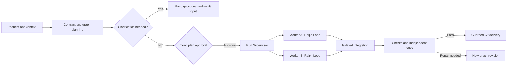

<p align="right">
  <a href="./README.md">English</a> | <strong>한국어</strong>
</p>

<div align="center">
  <h1>Ralph</h1>
  <p><strong>증거 중심의 그래프 기반 멀티 에이전트 소프트웨어 개발 오케스트레이션</strong></p>
  <p>
    하나의 자연어 요청을 승인 가능한 실행 그래프로 바꾸고, 독립적인 작업을 격리된 Ralph Loop로 실행하며,
    검증 증거와 복구 가능한 Git 이력을 바탕으로 결과를 통합합니다.
  </p>
  <p>
    <a href="#빠른-시작"><strong>빠른 시작</strong></a> ·
    <a href="#ralph의-작동-방식">작동 방식</a> ·
    <a href="#주요-명령">명령</a> ·
    <a href="#ralph-control-center">대시보드</a> ·
    <a href="./docs/architecture/index.md">아키텍처</a>
  </p>
  <p>
    
    <a href="https://github.com/worldclasscitizen/Ralph/actions/workflows/ci.yml"></a>
    
    
    <a href="./LICENSE"></a>
  </p>
</div>

> [!IMPORTANT]
> **0.3.0 프리뷰:** 이 브랜치는 그래프 기반 런타임의 정식 승격을 검증 중입니다. npm의 `beta` 태그는 아직 `0.2.0-beta.0`이며, `0.3.0`은 게시되지 않았습니다. 그래프 명령을 사용하려면 아래 소스 설치를 따라 주세요. 정식 승격은 [출시 게이트](./docs/project/v0.3-readiness.md)를 통과한 뒤 진행합니다.

## 왜 Ralph인가요?

자율 코딩에는 모델을 한 번 더 호출하는 것 이상의 구조가 필요합니다. 명확한 범위, 확정된 입력, 재현할 수 있는 검증, 중단 후 복구 절차가 있어야 합니다. Ralph는 이 요소들을 하나의 관찰 가능한 실행으로 연결합니다.

| 흔한 문제 | Ralph의 해결 방식 |
| :--- | :--- |
| 작업을 충분히 이해하기 전에 코드를 수정함 | 계약·그래프·검증 계획·공급자·예산을 먼저 검토하고 승인합니다. |
| 독립적인 작업도 긴 루프 하나를 기다림 | 의존성이 준비된 노드를 동시성 상한 안에서 실행합니다. |
| 병렬 에이전트가 서로의 변경을 덮어씀 | 쓰기 Worker마다 별도 Git worktree를 사용하고 겹치는 쓰기 범위는 순서를 지정합니다. |
| 재시도가 같은 실수를 반복함 | 각 Ralph Loop가 검증 결과와 미해결 완료 조건을 다음 반복으로 전달합니다. |
| Worker가 자신의 결과를 스스로 완료 처리함 | 로컬 검증과 독립 Critic이 평가하고 최종 통합도 다시 검증합니다. |
| 프로세스가 중단되어 무엇이 실행됐는지 알 수 없음 | 이벤트·아티팩트·커밋 기록으로 확인된 결과를 보존하고 불확실한 상태는 점검합니다. |
| 공급자 하나를 사용할 수 없게 됨 | 일시적 오류에는 제한된 재시도와 승인된 대체 경로를 사용하며 Hard Pin은 유지합니다. |
| 진행 상황이 모델의 컨텍스트에만 남음 | 파일·검증 증거·이벤트·Git 상태를 세션 밖에서도 확인할 수 있습니다. |
| 터미널의 `running` 표시 외에는 알기 어려움 | Control Center에서 그래프·반복·모델 선택·변경·사용량을 확인합니다. |

## 차별점

<table>
  <tr>
    <td align="left" width="33%"><strong>코드보다 계약이 먼저</strong><br>범위, 완료 기준, 검증, 모델 후보와 실행 한도를 함께 승인합니다.</td>
    <td align="center" width="34%"><strong>확신보다 증거가 먼저</strong><br>Worker는 내부에서 개선을 반복하고 결정적 검증과 독립 평가로 결과를 판정합니다.</td>
    <td align="right" width="33%"><strong>후회보다 Git이 먼저</strong><br>격리된 작업 공간, 보존된 체크포인트, 보호된 결과 반영으로 중단 전후의 작업을 지킵니다.</td>
  </tr>
</table>

- **하나의 Run, 여러 로컬 Loop:** DAG가 의존성을 조정하고 각 Worker는 기존 Ralph Loop를 실행합니다.
- **작업에 맞는 실행 크기:** 읽기 응답은 Worker 없이, 작은 변경은 Worker 하나로, 분리 가능한 작업은 병렬 분기로 처리합니다.
- **플랫폼 중립 실행:** 터미널과 선택적인 호스트 Skill이 같은 CLI와 승인 계약을 사용합니다.
- **사용자가 구성한 모델 포트폴리오:** CLI 구독과 API 연결을 별도 식별자·한도로 함께 사용합니다.
- **품질 우선 라우팅:** 승인된 기능과 고정 경로를 우선하고 비교 가능한 증거를 활용합니다. 측정하지 않은 품질은 등급을 만들지 않습니다.
- **복구 가능한 리비전:** 이전 실행 이력을 고치지 않고 새 노드 세대로 수정 작업을 수행합니다.
- **측정에 충실한 관측:** 미제공 사용량은 알 수 없음으로 남기고 비공개 사고과정 대신 작업 요약과 증거를 제공합니다.

## 빠른 시작

### 요구사항

- Node.js 22 또는 24
- Git과 변경 사항이 없는 Git 작업 트리
- 설정과 인증을 마친 공급자 연결 한 개 이상

### npm에서 설치

**0.3.0 정식 게시 후** 다음 명령으로 정확한 버전을 설치합니다.

```bash
npm install -g @worldclasscitizen/ralph@0.3.0
ralph --version
```

게시 전에는 아래 소스 설치를 사용합니다. 현재 npm 베타는 이전 Loop 런타임이며 이 문서의 그래프 명령을 제공하지 않습니다.

### 소스에서 설치

```bash
git clone --branch feat/graph-native-v0.3 https://github.com/worldclasscitizen/Ralph.git
cd Ralph
npm ci
npm run build
npm link
ralph --version
```

### 프로젝트 초기화와 실행

```bash
cd /absolute/path/to/a/clean/git-project
ralph init
ralph doctor
ralph plan "Improve login accessibility and add tests" --json
```

Ralph는 컨텍스트를 수집하고 설정된 공급자를 확인한 뒤 계약과 그래프를 저장합니다. 경로·완료 기준·검증 명령·모델·예산을 검토합니다. 반환된 `runId`로 확인한 바로 그 계획을 승인합니다.

```bash
ralph run --plan <run-id> --yes
ralph graph show <run-id> --format mermaid
ralph dashboard --open
```

대화형 `ralph run "요청"`은 계획과 승인을 이어서 진행합니다. 검토하지 않은 새 요청에 `--yes`를 붙이면 거부합니다. 내보낸 JSON은 대상 작업 트리 밖에 보관하며, 검토한 계획을 `ralph run --plan-stdin --yes`로 전달할 수도 있습니다.

다른 디렉터리에서는 프로젝트를 명시합니다.

```bash
ralph plan --project /absolute/path/to/project "Refactor the cache layer" --json
```

자세한 순서는 [첫 실행 안내](./docs/getting-started.md)를 확인합니다.

## Ralph의 작동 방식



TypeScript가 그래프 유효성·범위·스케줄링·예산·완료를 통제하고, 모델은 작업을 제안하고 증거를 평가합니다. 각 리비전은 DAG를 유지합니다. 반복은 Worker 내부에서 수행하고, 수정은 이전 결과를 보존한 새 리비전으로 진행합니다.

### Loop에서 Graph로

| 구분 | v0.2 Loop | v0.3 Graph |
| :--- | :--- | :--- |
| 실행 | 순차 역할 파이프라인 | 의존성이 준비된 노드 안에서 로컬 Loop 실행 |
| 작업 공간 | 공유 체크아웃 | 쓰기 Worker마다 별도 worktree |
| 이력 | Loop 반복 | Run → 리비전 → 노드 세대 → 반복 → 호출 시도 |
| 복구 | 반복 체크포인트 | 이벤트·증거·불변 입력·커밋 기록 |
| 통합 | Worker 체크포인트 | 별도 통합·최종 검증·보호된 결과 반영 |

### 평가와 종료

- Worker는 작업·결정적 검증·독립 평가를 거친 뒤 완료하거나 개선합니다.
- 공통 40점과 작업별 60점으로 구성된 rubric을 사용하며 기본 통과선은 85점입니다.
- 80~90점 경계 구간 또는 불명확한 Hard Gate는 독립 재심으로 확인합니다.
- 논리적인 Worker 작업당 최대 6회 반복하며 새 세대에서도 예산을 유지합니다. 첫 통과 시 즉시 종료합니다.
- 동일 실패 반복, 개선 정체, 불확실한 증거는 사유와 함께 작업을 중단합니다.
- 공급자 호출 성공만으로 완료하지 않으며, 전체 Run은 검증된 결과 반영까지 마쳐야 완료됩니다.

기본값은 Worker 4개, 연결당 호출 1개, 리비전당 노드 32개, 리비전 8회, 통합 수정 2회, 호출 시도 256회, 활성 시간 2시간입니다. 계획에서 한도를 확인하고 승인합니다. 사용자 입력 대기는 활성 시간에 포함하지 않습니다.

### 위험도별 검증

| 등급 | 일반적인 범위 | 보호 규칙 |
| :--- | :--- | :--- |
| `T0` | 문서와 저위험 계획 | 산출물·범위·증거 확인 |
| `T1` | 일반 코드 변경 | 등록된 프로젝트 테스트·린트·타입·빌드 |
| `T2` | 공개 API·스키마·대규모 리팩터링 | 격리 재검증과 조건부 변이 검사 |
| `T3` | 인증·결제·권한·마이그레이션·비밀값 | T2 검증과 필수 최종 확인 |

커버리지 기준선, 보호된 불변 조건, 테스트 약화 탐지를 로컬에서 강제합니다. 검증기는 구문뿐 아니라 요청한 동작을 확인해야 합니다. [아키텍처](./docs/architecture/index.md)

## 작업별 라우팅

| 작업 유형 | 적합한 작업 |
| :--- | :--- |
| `planning_architecture` | 요구사항·트레이드오프·시스템 경계 |
| `frontend_visual` | UI·반응형 동작·접근성 |
| `backend_core` | API·데이터 모델·비즈니스 로직 |
| `tdd_debugging` | 재현·원인 분석·회귀 테스트 |
| `static_review` | 타입·보안·유지보수성 |
| `delivery_evidence` | 기술 증거·결과 전달 준비 |

### 실행 프로필

| 프로필 | 조건을 충족한 후보 사이의 우선순위 |
| :--- | :--- |
| `balanced` | 신뢰성·시간·확인 가능한 비용의 균형 |
| `quality` | 검증된 작업 적합성과 신뢰성 |
| `fast` | 품질이 동등할 때 낮은 지연 |
| `budget` | 품질이 동등할 때 확인된 낮은 비용 |

```bash
ralph config pipelines
ralph config explain --profile quality
ralph config preset fast
ralph config route list
```

배정 전 승인된 기능과 가용성을 확인합니다. 고정 경로와 Hard Pin을 우선하고, 로컬 완료율은 같은 작업군·검증 조건에서 표본이 20개 이상일 때 비교합니다. 서로 다른 외부 벤치마크를 하나의 점수로 합산하지 않습니다. [라우팅 근거](./docs/providers/index.md)

## 공급자와 인증

| 연결 종류 | 예시 | 인증 |
| :--- | :--- | :--- |
| 내장 CLI | Codex·Claude Code·Gemini CLI, 실험적 Antigravity | 해당 CLI의 저장된 로그인 |
| 네이티브 API | OpenAI·Anthropic·Google Gemini | 자격 증명 참조 또는 환경 변수 |
| 호환 API | DeepSeek·GLM·명시적으로 설정한 호환 엔드포인트 | 공급자 API 키 참조 |
| 사용자 프로세스 | Ralph JSON/NDJSON 프로토콜 | 프로세스 어댑터에서 정의 |

CLI 로그인과 API 연결은 별개입니다. 사용하는 연결만 설정합니다. DeepSeek와 GLM만으로 계획·작업·평가를 구성할 수 있으며 Codex 로그인을 요구하지 않습니다. 자격 증명 저장 방식은 운영체제에 따라 다르고, Windows에서는 현재 환경 변수를 사용합니다.

```bash
ralph providers detect
ralph providers list
ralph auth status
ralph config refresh
```

<!-- provider-verification:start -->
| Connection / model | Support | Verified environment |
|---|---|---|
| Codex | compatible | Live release verification pending |
| Claude Code, Gemini CLI | compatible | Protocol tests; no current live verification |
| OpenAI, Anthropic, Gemini, DeepSeek, GLM APIs | compatible | Protocol tests; no current live verification |
| Antigravity | experimental | Requires a working automation interface |
| Other compatible endpoints | compatible | No live verification |
<!-- provider-verification:end -->

설치·로그인 여부와 동작 검증은 구분합니다. 지원 기록에는 실제 모델·CLI 버전·환경·검증 일자가 포함되며, mock 테스트만으로 실제 지원을 확정하지 않습니다. [설정과 지원 증거](./docs/providers/index.md)

## 주요 명령

### 기본 작업 흐름

| 명령 | 용도 |
| :--- | :--- |
| `ralph init` | 프로젝트 등록과 연결 탐지 |
| `ralph plan "request" --json` | 검토 가능한 계약과 그래프 저장 |
| `ralph run --plan <run-id> --yes` | 검토한 계획 승인과 실행 |
| `ralph status <run-id> --watch` | 실행 상태 확인 |
| `ralph stop <run-id>` | 제어된 중단 요청 |
| `ralph resume <run-id>` | 저장 상태를 확인하고 재개 가능한 작업 수행 |
| `ralph respond <run-id> --request <question-id> --stdin` | 저장된 확인 질문에 응답 |

### 진단과 설정

| 명령 | 용도 |
| :--- | :--- |
| `ralph doctor` | Git·인증·라우팅 진단 |
| `ralph config explain` | 경로와 정책 설명 |
| `ralph providers list` | 연결과 검증 범위 확인 |
| `ralph auth status` | 설치 여부와 구분된 인증 상태 확인 |
| `ralph catalog status` | 서명된 카탈로그 확인 |
| `ralph inspect-interruption <run-id> --json` | 복구 확인 전 보존된 Worker 점검 |

### 증거와 관측

| 명령 | 용도 |
| :--- | :--- |
| `ralph graph show <run-id> --format mermaid` | 컴파일된 그래프 표시 |
| `ralph explain <run-id> --node <node-id>` | 노드 결과와 이벤트 확인 |
| `ralph logs <run-id> --follow` | 실행 이벤트 추적 |
| `ralph usage` | 기록된 공급자·모델 사용량 확인 |
| `ralph dashboard --open` | 로컬 Control Center 열기 |
| `ralph migrate --to 0.3 --dry-run` | 이전 기록 전환 미리 보기 |

전체 옵션은 [CLI 명령 안내](./docs/reference/cli.md)와 [중단 복구 절차](./docs/architecture/recovery.md)를 확인합니다.

## 구조화된 자동화

호스트와 터미널은 같은 저장 계획·이벤트 인터페이스를 사용합니다.

```bash
ralph plan "Implement a bounded change and verify it" --json
ralph run --plan-stdin --yes --events ndjson
ralph status --json
```

두 번째 명령의 stdin으로 검토한 JSON을 전달합니다. JSON/NDJSON은 stdout, 사람용 안내는 stderr로 출력합니다. 필수 입력 대기는 종료 코드 10과 실행 ID를 반환합니다. 질문은 프로세스 종료 후에도 보존되며 시간 경과를 동의로 간주하지 않습니다. 호스트 컨텍스트는 정보를 보완할 수 있지만 승인 범위를 늘릴 수 없습니다.

## 선택적 AI 플랫폼 Skill

터미널 명령이 기준입니다. 호스트 Skill은 같은 CLI를 호출하고 별도의 실행 루프를 구현하지 않습니다.

```bash
ralph integrations install
ralph integrations status
```

| 호스트 | 설치 후 호출 |
| :--- | :--- |
| Codex | `$ralph Improve the login flow` |
| Claude Code | `/ralph Improve the login flow` |
| Antigravity | 지원되는 환경에서 `/ralph Improve the login flow` |
| Gemini CLI | 설치된 Ralph Skill 인터페이스 |
| 일반 터미널·IDE 터미널 | `ralph run "Improve the login flow"` |

## Git 상태와 안전성

상태는 `git rev-parse --git-path ralph` 경로 아래에 저장합니다. Worker worktree에도 확정된 이 경로를 전달해 실행 저장소가 분산되지 않게 합니다.

```text
ralph/
  config.json
  locks/
  runs/<run-id>/
    plan.json
    context.json
    events.jsonl
    snapshot.json
    nodes/<node-id>/<generation>/
    artifacts/
    workspaces/
    integration/delivery.json
```

- 아티팩트와 순번이 있는 이벤트로 각 결과의 입력과 증거를 보존합니다.
- 원장 재생은 모델 호출이나 Git 작업을 반복하지 않고 상태를 복원합니다.
- 통합 worktree에서 최종 검증을 수행하고 반영 전에 시작 브랜치·HEAD·사용자 파일을 다시 확인합니다.
- 사용자 변경이 있으면 검증된 결과를 `ralph/result-<run-id>`에 보존하고 반영을 보류합니다.
- 프로세스 결과가 불확실하면 새 Worker 실행 전에 점검합니다.
- Worktree는 변경 격리 수단이며 보안 샌드박스는 아닙니다. 소비자 실행은 자동 push·배포·rollback을 수행하지 않습니다.

## Ralph Control Center

```bash
ralph dashboard --open
```


*패키지에 포함된 실제 대시보드의 mock 공급자 실행 화면입니다. 실제 공급자 호출을 검증한 증거로 사용하지 않습니다.*

Control Center는 `127.0.0.1`에 열리며 npm 패키지에 포함됩니다. 별도 프런트엔드 서버를 실행할 필요가 없습니다.

- Run 하나당 이력 하나, 그래프 리비전과 노드 세대 탐색
- 모델·상태·경과 시간·반복 횟수를 표시하는 의존성 캔버스
- 작업 요약·검증 증거·파일 diff·공급자 오류를 확인하는 Inspector
- 공급자 사용량 분포와 작업군별 호출 수, 미제공 값의 명시적 구분
- 이벤트 순번으로 이어받는 SSE와 상태 갱신 중 유지되는 노드 위치
- 키보드 탐색, 반응형 Inspector, 긴 로그의 가상 스크롤

제어 명령에는 로컬 토큰과 일치하는 Origin이 필요합니다. 최초 승인과 확인 질문은 CLI 또는 라이브러리에서 처리합니다. [Control Center 안내](./docs/dashboard/index.md)

## 모델 카탈로그와 대체 경로 정책

Ralph는 별도 갱신·캐시 경로를 사용하는 Ed25519 서명 v2 카탈로그를 포함합니다. 이전 클라이언트를 위해 원본 v0.2 카탈로그와 서명도 보존합니다.

- 모델 항목은 공식 출처를 기록하고 근거 없는 품질 측정은 `unrated`로 표시합니다.
- 카탈로그 교체 전에 서명·스키마·버전·만료를 검사합니다.
- 승인된 실행은 카탈로그·후보 목록·실행 정책을 고정합니다.
- Gateway는 실행 전체 예산 안에서 후보당 2회, 논리 호출당 6회까지 시도합니다.
- 일시적 오류에는 제한된 대기와 승인된 대체 경로를 적용합니다. 인증·정책 오류는 보류하고 Hard Pin을 임의 교체하지 않습니다.
- 취소 결과가 불확실하면 재시도 전에 점검합니다. 사용량과 비용은 실제 측정 수준을 구분합니다.

```bash
ralph catalog status
ralph catalog diff
ralph catalog update
```

## 이전 버전 마이그레이션

이력·자격 증명 참조·공급자 식별자·Hard Pin을 보존합니다. 변환 manifest를 작성하기 전에 미리 확인합니다.

```bash
ralph migrate --to 0.3 --dry-run
ralph migrate --to 0.3
```

완료된 v0.2 실행은 읽기 전용 이력으로 남깁니다. 중단 작업은 점검과 새로운 그래프 승인이 필요하며 이전 승인과 세션 ID를 재사용하지 않습니다. 원본 기록을 자동 삭제하지 않습니다. Bash 템플릿 가져오기는 별도 호환 경로로 유지합니다. [전환 안내](./docs/migration/v0.3.md)

## 개발

```bash
npm ci
npm run build
npm test
npm run test:coverage
npm run check:core
npm run test:e2e
npm run docs:check
npm run docs:build
npm run smoke
```

CI는 Windows·macOS·Linux와 Node.js 22·24 조합을 검사합니다. 같은 tarball을 모든 조합에 설치합니다. 복구 시험은 실제 fixture 프로세스를 중단하고, 브라우저 시험은 노드 32개·리비전 8개·로그 10만 줄을 확인합니다. 핵심 모듈 10개는 line·branch coverage 각각 90% 이상을 요구합니다.

Mock 테스트는 유료 모델을 호출하지 않습니다. 실제 출시 검증은 명시적으로 실행하며 호출 24회·활성 시간 30분의 예산을 공유합니다. 실패와 취소도 포함하고 재실행으로 소비량을 초기화하지 않습니다. [출시 검증](./docs/project/v0.3-readiness.md)

## 문서

| 문서 | 용도 |
| :--- | :--- |
| [시작 안내](./START_HERE.md) | 사용자와 AI 온보딩 |
| [첫 실행](./docs/getting-started.md) | 설치와 검토한 계획 실행 |
| [아키텍처](./docs/architecture/index.md) | 그래프 상태·Loop·스케줄링·통합 |
| [복구](./docs/architecture/recovery.md) | 중단 호출과 보호된 결과 반영 |
| [공급자](./docs/providers/index.md) | 연결·라우팅·지원 증거 |
| [Control Center](./docs/dashboard/index.md) | 대시보드와 이벤트 API |
| [CLI 명령](./docs/reference/cli.md) | 명령과 구조화된 입력 |
| [전환 안내](./docs/migration/v0.3.md) | v0.2 이력과 설정 보존 |
| [출시 준비 상태](./docs/project/v0.3-readiness.md) | 측정한 검사와 남은 조건 |
| [릴리스 안내](./docs/RELEASING.md) | npm 게시와 GitHub Release |

## 프로젝트 상태

Ralph 0.3.0은 출시 검증 중입니다. 실제 요청으로 그래프를 생성하고 Worker 실행·통합·검증·시작 브랜치 반영까지 완료해야 정식 게시합니다. [검증 기록](./docs/project/release-campaign-2026-09-05.md)에 이전 비교 시도의 실패와 남은 호출 예산을 보존합니다. 과거 비교는 참고 자료이며, 일반적인 품질·속도·비용 우위를 주장하지 않습니다.

0.3.0의 실행 범위는 한 컴퓨터입니다. 원격 실행, 자유 조건식 그래프, 모든 외부 동작의 자동 복구 보장은 포함하지 않습니다. 재현 가능한 결함은 [GitHub Issues](https://github.com/worldclasscitizen/Ralph/issues)에 남길 수 있습니다.

## 라이선스

[MIT](./LICENSE)

Ralph는 Geoffrey Huntley가 대중화한 자율 반복 패턴을 기반으로 하며, 명시적 계약·그래프 오케스트레이션·멀티 공급자 라우팅·증거 기반 평가·Git 복구 구조를 추가했습니다.
