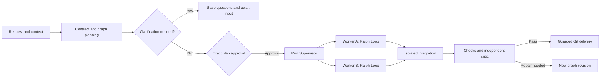

<p align="right">
  <strong>English</strong> | <a href="./README.ko.md">한국어</a>
</p>

<div align="center">
  <h1>Ralph</h1>
  <p><strong>Evidence-first, graph-native multi-agent orchestration for software delivery.</strong></p>
  <p>
    Turn one natural-language request into an approved execution graph, run independent work in isolated Ralph Loops,
    and bring the results together with verification evidence and recoverable Git history.
  </p>
  <p>
    <a href="#quick-start"><strong>Quick start</strong></a> ·
    <a href="#how-ralph-works">How it works</a> ·
    <a href="#command-reference">Commands</a> ·
    <a href="#ralph-control-center">Dashboard</a> ·
    <a href="./docs/architecture/index.md">Architecture</a>
  </p>
  <p>
    
    <a href="https://github.com/worldclasscitizen/Ralph/actions/workflows/ci.yml"></a>
    
    
    <a href="./LICENSE"></a>
  </p>
</div>

> [!IMPORTANT]
> **0.3.0 preview:** this branch contains the graph-native runtime under release verification. The npm `beta` tag still points to `0.2.0-beta.0`; `0.3.0` has not been published. Use the source installation below to try the graph commands. Stable promotion depends on the [release gates](./docs/project/v0.3-readiness.md).

## Why Ralph?

An autonomous coding task needs more than another model call. It needs a clear scope, dependable inputs, reproducible checks, and a way to recover when work stops. Ralph connects those pieces in one inspectable run.

| Typical failure | Ralph's answer |
| :--- | :--- |
| The agent edits code before the task is understood | Review and approve the contract, graph, verification plan, providers and budget first. |
| Independent tasks wait for one long loop | A dependency-aware scheduler starts ready nodes with bounded concurrency. |
| Parallel agents overwrite one another's changes | Writing workers use separate Git worktrees; overlapping write scopes are ordered. |
| Retries repeat the same mistake | Each Ralph Loop carries verifier findings and unresolved criteria into its next iteration. |
| A worker declares its own output complete | Local checks and an independent critic evaluate it; final integration is verified again. |
| A process stops and nobody knows what ran | Durable events, artifacts and commit receipts preserve known outcomes; uncertainty requires inspection. |
| One provider becomes unavailable | Bounded retries and approved alternatives handle transient errors; Hard Pins remain fixed. |
| Progress lives only in a model's context window | Files, verifier evidence, events and Git state remain available outside the session. |
| A terminal only says “running” | The Control Center shows the graph, iterations, model choices, changes and usage. |

## What makes it different?

<table>
  <tr>
    <td align="left" width="33%"><strong>Contract before code</strong><br>Scope, completion criteria, checks, model candidates and execution limits are approved together.</td>
    <td align="center" width="34%"><strong>Evidence before confidence</strong><br>Workers improve locally; deterministic checks and independent assessment decide whether results qualify.</td>
    <td align="right" width="33%"><strong>Git before regret</strong><br>Isolated workspaces, retained checkpoints and guarded delivery protect work across interruptions.</td>
  </tr>
</table>

- **One run, many local loops:** the DAG coordinates dependencies while each worker retains the iterative Ralph Loop.
- **The right execution size:** read-only answers need no worker graph; small changes use one worker; separable work can use parallel branches.
- **Platform-neutral control:** terminals and optional host Skills use the same CLI and approval contracts.
- **Your configured model portfolio:** CLI subscriptions and API connections coexist with separate identities and limits.
- **Quality-first routing:** approved capabilities and pins come first; comparable evidence informs later choices. Unmeasured quality stays unrated.
- **Recoverable revisions:** repair creates new node generations without rewriting earlier execution history.
- **Honest observability:** unknown usage stays unknown; work summaries and evidence do not expose hidden reasoning.

## Quick start

### Requirements

- Node.js 22 or 24
- Git and a clean Git working tree
- At least one configured, authenticated provider connection

### Install from npm

**After 0.3.0 is published**, install the exact stable version with:

```bash
npm install -g @worldclasscitizen/ralph@0.3.0
ralph --version
```

Until publication, use the source installation below. The existing npm beta contains the earlier loop runtime and does not provide these graph commands.

### Install from source

```bash
git clone --branch feat/graph-native-v0.3 https://github.com/worldclasscitizen/Ralph.git
cd Ralph
npm ci
npm run build
npm link
ralph --version
```

### Initialize and run

```bash
cd /absolute/path/to/a/clean/git-project
ralph init
ralph doctor
ralph plan "Improve login accessibility and add tests" --json
```

Ralph collects context, resolves configured providers, and saves a contract and graph. Review the paths, acceptance criteria, verifier commands, models and budget. Then use the returned `runId` to approve that exact plan:

```bash
ralph run --plan <run-id> --yes
ralph graph show <run-id> --format mermaid
ralph dashboard --open
```

For an interactive flow, `ralph run "your request"` connects planning and approval. An unseen request with `--yes` is rejected. Keep exported JSON outside the target working tree; reviewed plans can also be passed through `ralph run --plan-stdin --yes`.

From another directory, select the project explicitly:

```bash
ralph plan --project /absolute/path/to/project "Refactor the cache layer" --json
```

See the [first-run guide](./docs/getting-started.md).

## How Ralph works



TypeScript enforces graph validity, scope, scheduling, budgets and completion. Models propose work and assess evidence. Every revision remains acyclic: iterations happen inside a worker, and repair creates a new revision while preserving prior results.

### From Loop to Graph

| Concern | v0.2 Loop | v0.3 Graph |
| :--- | :--- | :--- |
| Execution | Sequential role pipeline | Dependency-ready nodes containing local loops |
| Workspace | Shared checkout | Separate worktree per writing worker |
| History | Loop iterations | Run → revision → node generation → iteration → attempt |
| Recovery | Iteration checkpoints | Events, evidence, immutable inputs and commit receipts |
| Integration | Worker checkpoints | Separate integration, final validation and guarded delivery |

### Evaluation and stopping

- Workers act, run deterministic verifiers, receive independent assessment, then complete or improve.
- The rubric combines 40 common points and 60 task-specific points; the default passing threshold is 85.
- Boundary adjudication handles scores from 80 to 90 or unclear hard gates.
- Each logical worker has at most six iterations, including later generations. A first pass ends immediately.
- Repeated failures, stagnant progress and uncertain evidence stop work with an explanation.
- A successful provider exit never suffices; the final run completes only after verified result delivery.

Defaults allow four workers, one active invocation per connection, 32 nodes per revision, eight revisions, two integration repairs, 256 attempts and two active hours. The approved plan exposes these limits. Waiting for user input is excluded from active time.

### Risk-tier verification

| Tier | Typical scope | Protection |
| :--- | :--- | :--- |
| `T0` | Documentation and low-risk planning | Artifact, scope and evidence checks |
| `T1` | Normal code changes | Registered project tests, lint, types and build |
| `T2` | Public API, schema or large refactor | Isolated re-verification and conditional mutation checks |
| `T3` | Authentication, payment, permissions, migration or secrets | T2 checks plus mandatory final confirmation |

Coverage baselines, protected invariants and test-tampering checks are enforced locally. Verifiers should demonstrate the requested behavior, not just syntax. [Architecture](./docs/architecture/index.md)

## Task-aware routing

| Task type | Optimized for |
| :--- | :--- |
| `planning_architecture` | Requirements, trade-offs and system boundaries |
| `frontend_visual` | UI, responsive behavior and accessibility |
| `backend_core` | APIs, data models and business logic |
| `tdd_debugging` | Reproduction, root causes and regression tests |
| `static_review` | Types, security and maintainability |
| `delivery_evidence` | Technical evidence and delivery readiness |

### Execution profiles

| Profile | Priority among qualified candidates |
| :--- | :--- |
| `balanced` | Balance reliability, time and available cost evidence |
| `quality` | Prefer verified task fit and reliability |
| `fast` | Prefer lower latency when quality is equivalent |
| `budget` | Prefer lower known cost when quality is equivalent |

```bash
ralph config pipelines
ralph config explain --profile quality
ralph config preset fast
ralph config route list
```

Approved capabilities and availability are checked before assignment. Fixed routes and Hard Pins take priority. Comparable local completion samples require the same task category and verification protocol, with at least 20 observations. Different external benchmark families are not added into one score. [Routing evidence](./docs/providers/index.md)

## Providers and authentication

| Connection family | Examples | Authentication |
| :--- | :--- | :--- |
| Built-in CLI | Codex, Claude Code, Gemini CLI; experimental Antigravity | That CLI's stored login |
| Native API | OpenAI, Anthropic, Google Gemini | Credential reference or environment variable |
| Compatible API | DeepSeek, GLM, configured compatible endpoints | Provider API-key reference |
| Custom process | Ralph JSON/NDJSON protocol | Defined by the process adapter |

CLI login and API connections remain separate. Configure only what you use: DeepSeek and GLM can supply planning, work and evaluation without a Codex login. Credential storage depends on the operating system; Windows currently uses environment variables.

```bash
ralph providers detect
ralph providers list
ralph auth status
ralph config refresh
```

<!-- provider-verification:start -->
| Connection / model | Support | Verified environment |
|---|---|---|
| Codex | compatible | Live release verification pending |
| Claude Code, Gemini CLI | compatible | Protocol tests; no current live verification |
| OpenAI, Anthropic, Gemini, DeepSeek, GLM APIs | compatible | Protocol tests; no current live verification |
| Antigravity | experimental | Requires a working automation interface |
| Other compatible endpoints | compatible | No live verification |
<!-- provider-verification:end -->

Installation and login are distinct from verified behavior. Support records identify the actual model, CLI version, environment and verification date; mock tests do not establish live support. [Configuration and support evidence](./docs/providers/index.md)

## Command reference

### Core workflow

| Command | Purpose |
| :--- | :--- |
| `ralph init` | Register the project and discover connections |
| `ralph plan "request" --json` | Save a reviewable contract and graph |
| `ralph run --plan <run-id> --yes` | Approve and execute the reviewed plan |
| `ralph status <run-id> --watch` | Follow the run state |
| `ralph stop <run-id>` | Request controlled interruption |
| `ralph resume <run-id>` | Reconcile saved state and continue eligible work |
| `ralph respond <run-id> --request <question-id> --stdin` | Answer a saved clarification request |

### Diagnosis and configuration

| Command | Purpose |
| :--- | :--- |
| `ralph doctor` | Diagnose Git, authentication and routing |
| `ralph config explain` | Explain routes and policies |
| `ralph providers list` | Inspect connections and verification scope |
| `ralph auth status` | Inspect authentication separately from installation |
| `ralph catalog status` | Inspect the signed catalog |
| `ralph inspect-interruption <run-id> --json` | Inspect a retained worker before reconciliation |

### Evidence and observability

| Command | Purpose |
| :--- | :--- |
| `ralph graph show <run-id> --format mermaid` | View the compiled graph |
| `ralph explain <run-id> --node <node-id>` | Inspect node results and events |
| `ralph logs <run-id> --follow` | Follow execution events |
| `ralph usage` | Inspect recorded provider/model usage |
| `ralph dashboard --open` | Open the local Control Center |
| `ralph migrate --to 0.3 --dry-run` | Preview migration of older records |

See the [complete CLI reference](./docs/reference/cli.md) and [interruption recovery procedure](./docs/architecture/recovery.md).

## Structured automation

Hosts use the same saved-plan and event boundary as the terminal:

```bash
ralph plan "Implement a bounded change and verify it" --json
ralph run --plan-stdin --yes --events ndjson
ralph status --json
```

Pass the reviewed JSON to the second command's stdin. JSON/NDJSON goes to stdout; human guidance goes to stderr. Required input returns exit code 10 and a run ID. Questions persist across processes; elapsed time never implies consent. Host context can add information but cannot expand the approval scope.

## Optional AI-platform Skills

The terminal command is canonical. Host Skills invoke the same CLI and do not implement a separate execution loop.

```bash
ralph integrations install
ralph integrations status
```

| Host | Invocation after installation |
| :--- | :--- |
| Codex | `$ralph Improve the login flow` |
| Claude Code | `/ralph Improve the login flow` |
| Antigravity | `/ralph Improve the login flow`, where supported |
| Gemini CLI | The installed Ralph Skill interface |
| Terminal or IDE terminal | `ralph run "Improve the login flow"` |

## Git-backed state and safety

State stays under `git rev-parse --git-path ralph`. Worker worktrees receive that resolved path; they do not create competing run stores.

```text
ralph/
  config.json
  locks/
  runs/<run-id>/
    plan.json
    context.json
    events.jsonl
    snapshot.json
    nodes/<node-id>/<generation>/
    artifacts/
    workspaces/
    integration/delivery.json
```

- Artifacts and sequence-numbered events preserve the input and evidence behind each result.
- Replay reconstructs state without invoking models or repeating Git operations.
- Final validation runs in an integration worktree; delivery rechecks the original branch, HEAD and user files.
- User changes preserve the validated result on `ralph/result-<run-id>` and pause delivery.
- Unconfirmed process outcomes require inspection before another worker can start.
- Worktrees isolate changes but are not security sandboxes. Consumer runs do not automatically push, deploy or roll back.

## Ralph Control Center

```bash
ralph dashboard --open
```


*Actual packaged dashboard capture using a mock-provider fixture; this is not evidence of a live-provider run.*

The Control Center binds to `127.0.0.1` and ships with the npm package. No separate frontend server is needed.

- One history entry per run, with graph revisions and node generations
- Dependency canvas with model identity, state, duration and iteration counts
- Inspector for work summaries, verifier evidence, file diffs and provider errors
- Provider usage distributions and task-category counts, with unknown values left explicit
- Sequence-based SSE reconnection and stable positions during status updates
- Keyboard navigation, responsive inspection and virtualized long logs

Control commands require a local token and matching Origin. Initial approval and clarification use the CLI or library. [Control Center guide](./docs/dashboard/index.md)

## Model catalog and fallback policy

Ralph bundles an Ed25519-signed v2 catalog with a separate update/cache channel. The original v0.2 catalog and signature remain available for older clients.

- Official sources identify model entries; unsupported quality measurements stay `unrated`.
- Signature, schema, version and expiry checks precede catalog replacement.
- Approved runs freeze the catalog, candidate portfolio and execution policy.
- The gateway permits two attempts per candidate and six per logical invocation, within the run budget.
- Transient errors use bounded delay and approved alternatives. Authentication or policy failures pause; Hard Pins never silently rotate.
- Unknown cancellation outcomes are inspected before retrying. Usage and cost retain their actual measurement level.

```bash
ralph catalog status
ralph catalog diff
ralph catalog update
```

## Legacy migration

History, credential references, provider identities and Hard Pins are preserved. Preview the conversion before writing its manifest:

```bash
ralph migrate --to 0.3 --dry-run
ralph migrate --to 0.3
```

Completed v0.2 runs remain read-only history. Interrupted work requires inspection and a new approved graph; old approvals and session IDs are not reused. Original records are not automatically deleted. The Bash-template importer remains a separate compatibility path. [Migration guide](./docs/migration/v0.3.md)

## Development

```bash
npm ci
npm run build
npm test
npm run test:coverage
npm run check:core
npm run test:e2e
npm run docs:check
npm run docs:build
npm run smoke
```

CI covers Windows, macOS and Linux with Node.js 22 and 24. One archive is installed across the matrix. Recovery checks terminate real fixture processes; browser cases cover 32 nodes, eight revisions and 100,000 log lines. Ten critical modules require at least 90% line and branch coverage.

Mock tests make no paid model calls. Live release checks are opt-in and share a persistent 24-call, 30-active-minute allowance. Failures and cancellations count; reruns do not reset consumption. [Release verification](./docs/project/v0.3-readiness.md)

## Documentation

| Document | Purpose |
| :--- | :--- |
| [Start here](./START_HERE.md) | User and AI onboarding |
| [First run](./docs/getting-started.md) | Installation and reviewed-plan execution |
| [Architecture](./docs/architecture/index.md) | Graph state, loops, scheduling and integration |
| [Recovery](./docs/architecture/recovery.md) | Interrupted calls and guarded delivery |
| [Providers](./docs/providers/index.md) | Connections, routing and support evidence |
| [Control Center](./docs/dashboard/index.md) | Dashboard and event API |
| [CLI reference](./docs/reference/cli.md) | Commands and structured input |
| [Migration](./docs/migration/v0.3.md) | Preserving v0.2 history and settings |
| [Release readiness](./docs/project/v0.3-readiness.md) | Measured checks and remaining gates |
| [Release guide](./docs/RELEASING.md) | npm publication and GitHub Releases |

## Project status

Ralph 0.3.0 is in release verification. Stable publication requires a real request to generate a graph and complete worker execution, integration, validation and branch delivery. The [campaign review](./docs/project/release-campaign-2026-09-05.md) preserves earlier failed comparison attempts and the remaining test allowance. Historical comparisons are reference material; no general quality, speed or cost advantage is claimed.

Version 0.3.0 targets one local machine. Remote execution, arbitrary conditional graphs and guaranteed automatic recovery of every external action are outside its scope. Report reproducible defects through [GitHub Issues](https://github.com/worldclasscitizen/Ralph/issues).

## License

[MIT](./LICENSE)

Ralph builds on the autonomous iteration pattern popularized by Geoffrey Huntley, adding explicit contracts, graph orchestration, multi-provider routing, evidence-based evaluation and Git-backed recovery.
